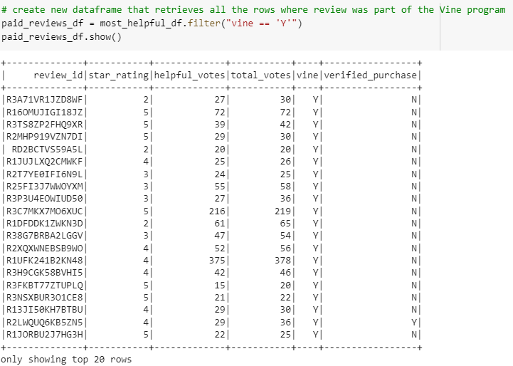
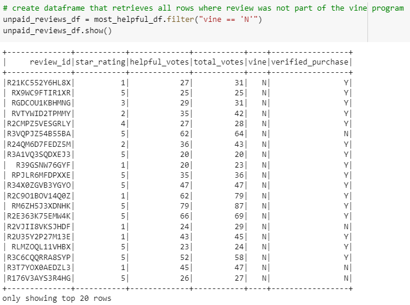
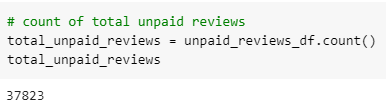
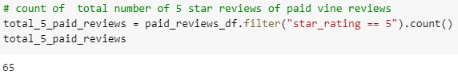
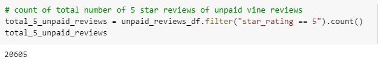
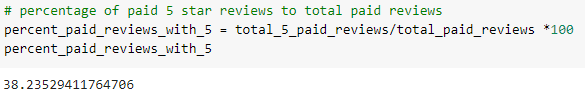
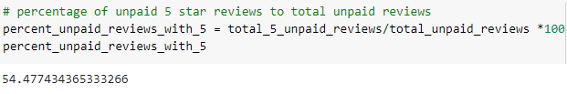

# Amazon Vine Analysis

## Project Overview
The Amazon Vine program is a service that allows manufacturers and publishers to receive reviews for their products.  Companies pay a small fee to Amazon and provide products to Amazon Vine members, who are then required to publish a review.  For this project, the pet products dataset from Amazon was selected.  By utilizing PySpark to perform the ETL process and analysis, we will determine if there is any bias toward favorable reviews from Vine members in the pet products dataset.

## Resources
 - Data Sources:  [Amazon Reviews dataset for pet products](https://s3.amazonaws.com/amazon-reviews-pds/tsv/amazon_reviews_us_Pet_Products_v1_00.tsv.gz)
 - Software: AWS RDS Postgres v. 12.8, Amazon S3 bucket, PGAdmin v. 5.7, Google Colab with PySpark 3.2.0

## Results
A dataframe containing information related to Vine reviews was first created. From that dataframe, we further filtered it to create another dataframe of just the rows in which the total votes were greater than or equal to 20.  Finally, we filtered the preceding dataframe down to retrieve all rows where the ratio of helpful reviews to total votes was equal to or greater than 50%.

```
# Create the vine_table. DataFrame
vine_df = clean_df.select(['review_id', 'star_rating', 'helpful_votes', 'total_votes', 'vine', 'verified_purchase'])
vine_df.show()

# create new dataframe to retrieve all rows where total votes is => 20
high_total_df = vine_df.filter('total_votes>= 20')
high_total_df.show()

# create a new dataframe to retrieve all rows where the number of helpful votes/total votes is >= 50%
most_helpful_df = high_total_df.filter('(helpful_votes/total_votes)>=0.5')
most_helpful_df.show()
```
 - Number of Vine Reviews vs Non-Vine Reviews

From here we created a dataframe containing reviews that were part of the Vine program.


There are 170 reviews that were part of the Vine program.


To determine the number of non-Vine reviews, we created another dataframe and ran a count of those rows.




 - Number of 5 Star Vine Reviews vs. 5 Star Non-Vine Reviews

 Utilizing the paid Vine reviews dataframe, we filtered for 5 star ratings and ran a count of those to determine that only 65 of the paid reviews received a 5 star rating.

 

 Then the non-Vine review dataframe was also filtered and counted to determine that there were 20,605 ratings that received 5 stars.

 

 - Percentages of 5 Star Reviews

 The percentage of 5 star ratings for the Vine reviews was 38%.
 

 The percentage of 5 star ratings for non-Vine reviews was 54%.
 

## Summary

 There does not appear to be any positivity bias for reviews in the Vine program, as only 38% of Vine program reviews received 5 stars.  Yet, 54% of non-Vine reviewers gave a 5 star rating to the product.  We could further determine if any there was any positivity bias among those Vine reviewers who actually had a verified purchase of the product versus vine reviewers who did not purchase the product.  It may be beneficial for manufacturers to know if Vine reviewers deliver a more critical review if they do not have a verified product purchase.